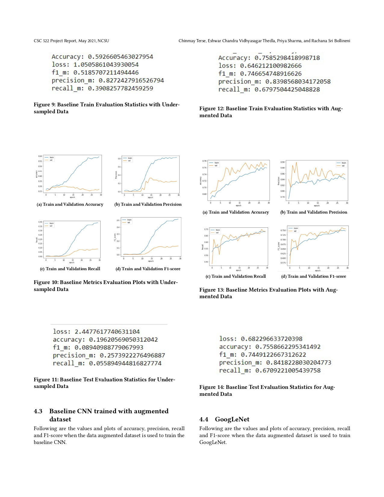
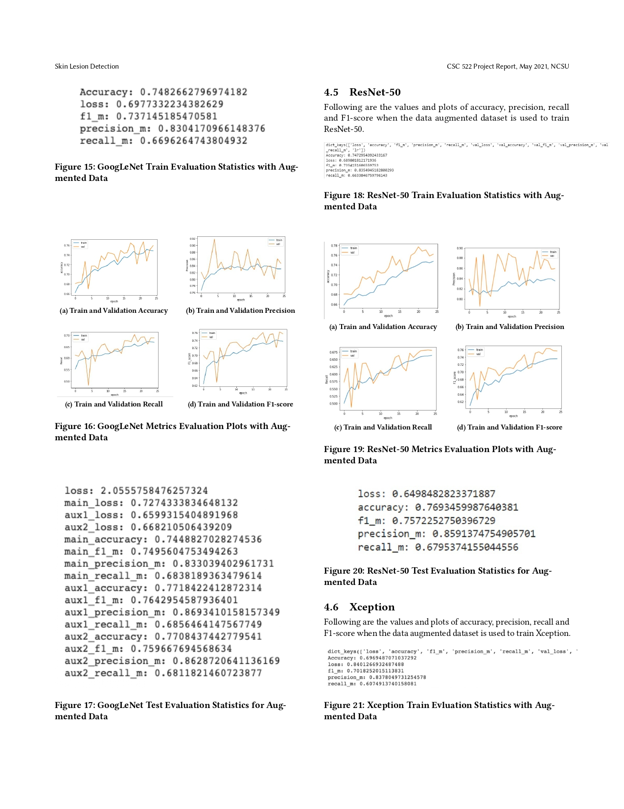
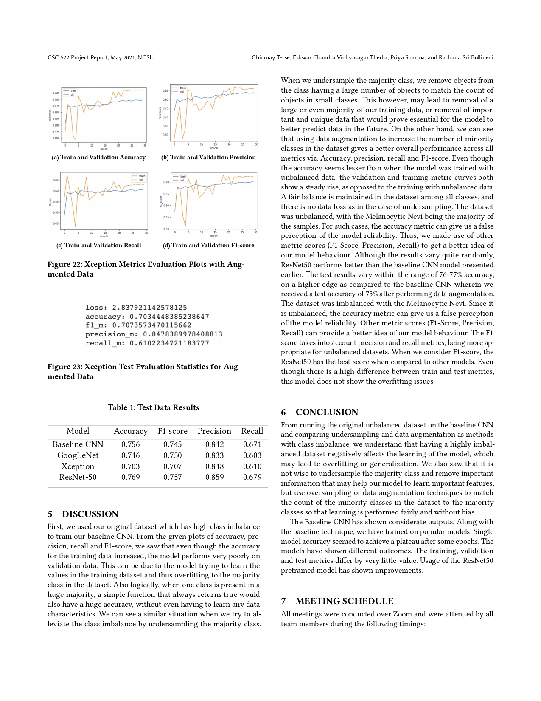

# Lesion-Detection

The input data is the HAM10000 dataset, which is a dataset of 10,015 skin lesion images in .jpg format. Each image is a 600 x 450 px, roughly 250 KB JPEG image.

- Each of the images in the training set is first normalized by subtracting the mean of the training data set, then dividing each object by the standard deviation of the set.
- In the following steps, a CNN model is built to serve as an initial baseline and then different pre-trained models are used to implement transform learning. Every image in all the sets i.e. training, validation, and test, is resized to a height of 75 px and a width of 100 px for use with the baseline CNN model, or as required by any model used in transform learning.
- The images are encoded in a(75,100,3) array for the baseline CNN or as required by other used models, where the last axis is used to record the color information as all our images are RGB images.

Class Imbalance:

The counts of the 7 classes in the data set, we can see that there are nearly 7000 instances of lesion label nv, while the other labels are comparable to each other but highly smaller in number compared to nv. This calls for balancing the number of objects in the input that we would provide to train our classification models, as there is a possibility of learning being skewed in favor of the majority class otherwise. This phenomenon is called class imbalance, and we can implement various techniques to equalize the approximate number of objects per class that are present in the training data set.

We plan to deal with class imbalance in the following ways in our project:
- Under sampling the majority class
- Using data augmentation to over sample images of minority classes

Classification Models:

- [Baseline](https://github.com/EshwarCVS/Lesion-Detection/blob/master/baseline.ipynb)
- [GoogLeNet](https://github.com/EshwarCVS/Lesion-Detection/blob/master/Googlenet.ipynb)
- [ResNet-50](https://github.com/EshwarCVS/Lesion-Detection/blob/master/ResNet50.ipynb)
- [VGGNet](https://github.com/EshwarCVS/Lesion-Detection/blob/master/VGG.ipynb)
- [Xception](https://github.com/EshwarCVS/Lesion-Detection/blob/master/Xception.ipynb)

Final Report:

